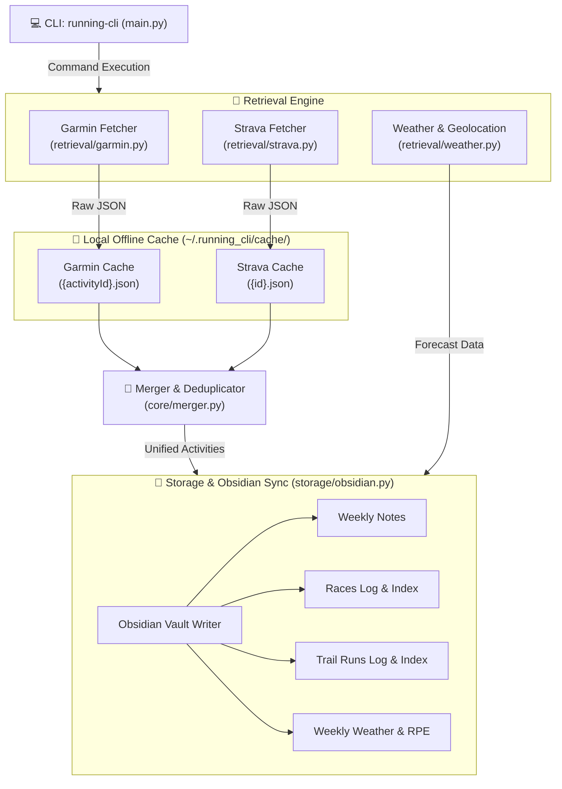

# 🏃‍♂️ Running CLI: App & Architecture Overview

Welcome to the central technical documentation and architecture overview of the **Running CLI** (`running-cli`) application. This document details the system design, core modules, data flows, and integration paradigms used to manage sports activities, synchronize them to Obsidian, and forecast running conditions.

---

## 🧭 System Architecture

The application is structured into four main layers: **CLI interface**, **Retrieval Engine**, **Core/Merger module**, and the **Storage/Obsidian Sync Engine**. 



---

## 📂 Directories & Configuration

The application maintains user state and caches in `~/.running_cli/`:

- **`config.json`**: Standard JSON file containing:
  - `obsidian_vault_path`: The absolute path to your Obsidian vault.
  - `obsidian_folder`: The subfolder (e.g., `Areas/Running`) where weekly summaries and subfolders are maintained.
  - `distance_unit`: Preferred unit (`"miles"` or `"km"`).
  - `weather_location`, `weather_lat`, `weather_lon`: Cached weather geolocation settings.
  - API Credentials: Garmin email, Strava Client ID, Client Secret, and Refresh Token.
- **`garmin_session/`**: Preserves session cookies generated by the `garminconnect` API client using `garth`. This enables passwordless logins and handles multi-factor authentication (MFA) parameters securely without storing passwords.
- **`cache/garmin/`**: Offline raw JSON data for synced Garmin activities (named `{activityId}.json`).
- **`cache/strava/`**: Offline raw JSON data for synced Strava activities (named `{id}.json`).

---

## 📡 Retrieval Engine

The Retrieval Engine interfaces with external APIs to fetch sports activities and meteorological forecasts.

### 1. Garmin Connect (`retrieval/garmin.py`)
- Leverages the `garminconnect` library.
- Attempts passwordless connection using the credentials stored in the `garmin_session` directory.
- Prompts for a password and MFA code only when starting from scratch or if session tokens expire.
- Pulls activities within the target date range and dumps raw API response JSONs locally for offline caching.

### 2. Strava API (`retrieval/strava.py`)
- Authenticates using standard OAuth 2.0 flow.
- The `setup` wizard runs a temporary local webserver (`http://localhost:8000`) to handle Strava's browser redirect and capture authorization codes.
- Automatically handles token rotation: refreshes expired access tokens using the `refresh_token` and updates `config.json` in-place.
- Fetches activity list from `/athlete/activities` using UTC epoch timestamps.

### 3. Open-Meteo Weather Forecast (`retrieval/weather.py`)
- Provides location lookups using the **Open-Meteo Geocoding API**.
- Includes IP-based geolocation fallback (`ip-api.com` / `ipapi.co`) if the user doesn't configure a location name.
- Queries the **Open-Meteo Forecast API** for hourly temperature, relative humidity, wind speed, wind direction, precipitation probability, and weather codes.
- Forecast queries automatically adjust units based on the configuration (Fahrenheit/mph for `miles` config; Celsius/kmh for `km` config).

---

## 🧩 Core Merger & Deduplication (`core/merger.py`)

Because running logs recorded on Garmin typically sync automatically to Strava, Garmin and Strava raw activities often duplicate the same session. The Merger module normalizes these inputs and performs clock-drift and distance-threshold matching to link overlapping records.

### Deduplication Rules

Two activities are considered duplicates if they meet all three criteria:

1. **Sport Matching**: The activities represent the same physical sport (e.g. `Run` vs `Run`, `Swim` vs `Swim`), or one of the activities is marked as `Other`.
2. **Start Time Match**: Absolute start times differ by less than **10 minutes** (600 seconds) to account for differing GPS acquisition times, manual start delays, and clock drifts.
3. **Distance Match**: Absolute distance differences are less than **500 meters** (0.31 miles) OR within **10%** of the average distance.

### Precedence Rules (Data Merging)

When two activities are merged, fields are combined by prioritizing the most reliable source:

- 📝 **Title & Description**: Strava takes precedence (allowing custom titles like *"Morning Trail with friends"* instead of Garmin's automatic *"Boston Running"*).
- 📏 **Distance & Duration**: Garmin takes precedence (relying on raw device GPS and device-calculated active elapsed duration).
- 💓 **Heart Rate**: Garmin takes precedence (relying on device sensor values for average/max heart rates).
- ⛰️ **Elevation Gain**: Garmin takes precedence (preferring barometric altimeter data over Strava's post-processed digital elevation models).

---

## 💾 Storage & Obsidian Sync Engine (`storage/obsidian.py`)

The Storage engine manages the structure and updates within the user's Obsidian Vault. 

### 1. File Structure in the Vault
```text
obsidian_vault_path/
└── Areas/Running/ (obsidian_folder)
    ├── Week of 2026-05-11.md
    ├── Week of 2026-05-18.md
    ├── WeeklyWeather.md
    ├── Races/
    │   ├── summary.md (Central Index)
    │   ├── 2026-04-20 - Boston Marathon.md
    │   └── 2026-05-18 - local race.md
    └── TrailRuns/
        ├── summary.md (Central Index)
        └── 2026-05-24 - Mount Washington Trail.md
```

### 2. Standardized Formatting
- **Swim Units**: Automatically converts swimming metrics: yards (`yd`) if configuration is `miles`, or meters (`m`) if configuration is `km`.
- **Pace Calculations**: Formats running/walking pace as minutes-per-unit (e.g., `8:02/mi`), cycling as speed (e.g., `15.4 mph`), and swimming pace per 100 units (e.g., `1:45/100yd`).
- **Location Pin Links**: If GPS coordinates are available, parses city/state names and renders a clickable Google Maps link in the format: `📍 [City, State](google_maps_url)`.
- **Sources Link**: Hyperlinks activity source columns directly to the Garmin Connect and Strava websites.

### 3. Safe-Update Mechanism (Preserving Manual Notes)
To ensure that custom journaling or manual notes written in Obsidian are not overwritten during a sync, the parser uses a **safe replacement boundary boundary**:
- Reads YAML frontmatter via `PyYAML`, merging updated stats while preserving custom keys added by the user.
- Employs matching tags inside the Markdown body:
  `%% START_WEEKLY_SUMMARY %%` and `%% END_WEEKLY_SUMMARY %%`
- Only replaces content *between* these comment blocks, keeping any personal journaling text below or above untouched.

---

## 🌦️ Running Exertion Impact (RPE)

The Weather Engine calculates a **Running Perceived Exertion (RPE) impact** score on a scale from `0.0` to `10.0+` to guide training intensities. It aggregates scores from:

1. **Humidity/Dew Point (Max 6.0 points)**: 
   Approximates dew point in Fahrenheit. High humidity limits sweat evaporation:
   - $<50^\circ\text{F}$: +0.0
   - $50$-$60^\circ\text{F}$: +0.5
   - $60$-$65^\circ\text{F}$: +1.5
   - $65$-$70^\circ\text{F}$: +3.0
   - $70$-$75^\circ\text{F}$: +4.5
   - $\ge75^\circ\text{F}$: +6.0
2. **Temperature (Max 5.0 points)**:
   Accounts for heat and extreme cold stresses:
   - $<20^\circ\text{F}$: +3.0
   - $20$-$32^\circ\text{F}$: +1.5
   - $32$-$60^\circ\text{F}$: +0.0 (Ideal)
   - $60$-$70^\circ\text{F}$: +0.5
   - $70$-$80^\circ\text{F}$: +1.5
   - $80$-$90^\circ\text{F}$: +3.0
   - $>90^\circ\text{F}$: +5.0
3. **Wind Speed (Max 3.5 points)**:
   Accounts for aerodynamic resistance:
   - $<10\text{ mph}$: +0.0
   - $10$-$18\text{ mph}$: +1.0
   - $18$-$25\text{ mph}$: +2.0
   - $>25\text{ mph}$: +3.5

### RPE Scale Ratings
- **0.0 - 1.5 (Ideal ☀️)**: Perfect running conditions. RPE is baseline.
- **1.6 - 3.0 (Moderate 🌤️)**: Slightly increased effort. Keep steady pace.
- **3.1 - 5.0 (Hard ⛅)**: Noticeable RPE increase. Slow pace slightly.
- **5.1 - 7.0 (Very Hard 🌧️)**: High cardiovascular strain. Hydrate and run by feel.
- **>7.0 (Extreme ⛈️)**: Severe strain. Avoid peak hours or run indoors.

---

## 🛠️ CLI Command Reference

Execute commands using `running-cli <command> [options]`:

| Command | Description |
|---|---|
| `setup` | Interactive setup wizard for directory paths, Garmin login, and Strava browser OAuth. |
| `status` | Checks current configuration, Garmin session integrity, and Strava OAuth token health. |
| `sync` | Syncs activities in range (defaults to last 7 days), caches raw files, deduplicates, and updates Obsidian notes. Supports `--days`, `--start-date`/`--end-date`, and `--races-only`. |
| `view` | Reads cache and prints a formatted text table and activity links directly to the terminal. |
| `open` | Interactive prompt to select a cached activity and open its Strava or Garmin webpage. |
| `races` | Displays race history directly in the terminal; supports `--start-date` filtering. |
| `trail-runs` | Displays trail running history directly in the terminal; supports `--start-date` filtering. |

---

## 🧪 Testing Suite

Run `pytest` to execute all unit tests. The suite includes:
- **`test_config.py`**: Configuration validation and path expanding.
- **`test_merger.py`**: Asserting deduplication tolerances, time limits, and priority merging rules.
- **`test_obsidian.py`**: Verifying frontmatter parsing, markdown safe updates, coordinate linking, and swim unit transformations.
- **`test_weather.py`**: Validating geolocation routines, Open-Meteo forecasts, and RPE calculation scales.
- **`test_cli.py`**: Simulating click prompts, command runner responses, and interactive prompts.
