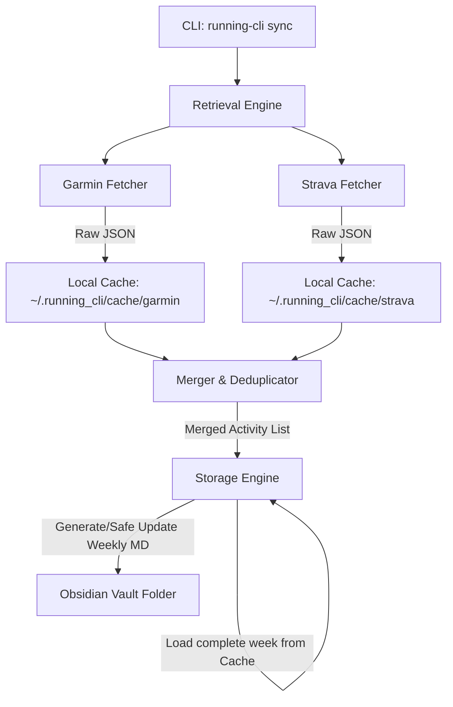

# Technical Implementation Specification

This document details the software design, data flows, deduplication logic, and file schemas for the `running-cli` sync tool.

---

## Architecture Overview

The tool splits responsibilities into three distinct modules:
1. **Retrieval**: Connects to the third-party Garmin and Strava APIs, pulls raw activity payload data within a given time range, and caches them offline.
2. **Core / Merger**: Normalizes the raw schema from both platforms and performs clock-drift and distance-threshold matching to link overlapping records.
3. **Storage**: Group activities into ISO-weeks, updates metadata YAML frontmatter, and formats a markdown summary log. It edits existing Obsidian files in-place using a safe replacement boundary.

---

## Module Specifications

### 1. Configuration & Directories
Configuration settings are stored in `~/.running_cli/config.json`:
- `obsidian_vault_path` (string): Absolute path to target vault.
- `obsidian_folder` (string): Vault subfolder where weekly files are saved.
- `distance_unit` (enum: `"miles"`, `"km"`): Target system units.
- `garmin`: Email (Garmin password is never stored).
- `strava`: Client ID, Client Secret, and Refresh Token.

Caches and session states:
- `~/.running_cli/garmin_session/`: Tokenstore directory managed by `garminconnect` to preserve session cookies and avoid repeated logins/MFA.
- `~/.running_cli/cache/garmin/`: Raw JSON activity summaries fetched from Garmin (named by `{activityId}.json`).
- `~/.running_cli/cache/strava/`: Raw JSON activity summaries fetched from Strava (named by `{id}.json`).

### 2. Retrieval Engine

#### Garmin Connect Retrieval (`src/running_cli/retrieval/garmin.py`)
- Initializes client using `garminconnect.Garmin` utilizing a local tokenstore session under `~/.running_cli/garmin_session/` via the underlying `garth` library.
- Attempts passwordless connection using stored session tokens first.
- Prompts for password and Multi-Factor Authentication (MFA) via standard input only when initializing or when the tokenstore session expires.
- Method `get_activities_by_date(start_date, end_date)` queries activities.
- Saves raw responses in cache directory.

#### Strava Retrieval (`src/running_cli/retrieval/strava.py`)
- Uses standard HTTP POST to refresh the Strava token using `client_id`, `client_secret`, and `refresh_token`.
- Automatically checks for refresh token rotations and writes back to `config.json`.
- Queries `GET https://www.strava.com/api/v3/athlete/activities` filtering via `before` and `after` epoch timestamps.
- Caches raw responses.

### 3. Core Merger & Deduplication (`src/running_cli/core/merger.py`)
Because running logs recorded on Garmin typically sync automatically to Strava, Garmin and Strava raw activities often duplicate the same session.
The `merge_activities` function compares activities from both providers to link duplicates.

**Deduplication Criteria**:
1. **Sport compatibility**: The activity sports must match (e.g. Run to Run, Swim to Swim) unless one of them is marked as `"Other"`.
2. **Start time difference**: Absolute start time difference is less than **10 minutes** (600 seconds) to account for different GPS startup times, upload latency, and clock drifts.
3. **Distance difference**: Absolute distance difference must be within **10%** of the average distance, or less than **500 meters** (useful for short activities).

**Precedence Rules for Merged Activities**:
- **Title**: Prioritize Strava's custom title (e.g., `"Morning Trail with friends"`) over Garmin's automatic title (e.g., `"Boston Running"`).
- **Distance**: Prioritize Garmin's raw device GPS distance.
- **Duration**: Prioritize Garmin's raw device elapsed duration.
- **Heart Rate**: Use Garmin's average and max heart rate, falling back to Strava.
- **Elevation**: Use Garmin's barometric elevation gain.
- **Description**: Prioritize Strava's description, falling back to Garmin.

### 4. Storage Engine (`src/running_cli/storage/obsidian.py`)

#### Unit & Format Standards
- **Distances**: 
  - Standard activities: Displays in miles (`mi`) or kilometers (`km`).
  - Swims: Displays in yards (`yd`) if unit preference is `miles`, or meters (`m`) if preference is `km`.
- **Pace**:
  - Running/Walking/Hiking: Minutes per unit (e.g., `8:02/mi` or `5:00/km`).
  - Cycling: Speed in unit-per-hour (e.g., `15.4 mph` or `24.0 km/h`).
  - Swimming: Minutes per 100 units (e.g., `1:45/100yd` or `2:00/100m`).
- **Elevation**: Feet (`ft`) or meters (`m`).
- **Duration**: `H:MM:SS` or `MM:SS`.

#### Starting Locations & Map Pins
- **Coordinates & Location Names**: Starting coordinates (latitude/longitude) and location names are extracted from:
  - Garmin: `locationName`, `startLatitude`, `startLongitude`
  - Strava: `location_city`/`location_state`, `start_latlng`
- **Map Pin Link**: A Google Maps link is generated using the starting coordinates: `https://www.google.com/maps/search/?api=1&query={lat},{lon}`
- **Obsidian Column**: The Obsidian log table features a `Location` column rendering the map pin and location name as a link: `📍 [Location Name](google_maps_url)` (falling back to `📍 [Map](google_maps_url)` if no city/location name is available).

#### Clickable Links & Collapsible Descriptions
- **Table Links**: The "Source" column in the weekly activity log renders clickable Markdown links to each activity page if IDs are available:
  - Garmin: `[Garmin](https://connect.garmin.com/modern/activity/{garmin_id})`
  - Strava: `[Strava](https://www.strava.com/activities/{strava_id})`
- **Descriptions Block**: Displays a dedicated `### Activity Notes` section below the weekly table containing a collapsible `
` and `
` element for each activity with a description.

#### Races Synchronization
- **Race Detection**: Race status is determined during activity parsing:
  - Garmin: Evaluates `eventType.typeKey == "race"`.
  - Strava: Evaluates `workout_type == 1`.
  - Merger: The unified activity is flagged as a race if either source is a race.
- **Races Folder**: Created as a subfolder `Races/` inside the configured Obsidian vault folder.
- **Individual Race Notes**: Written as `Races/YYYY-MM-DD - <Sanitized Title>.md`. Frontmatter and stats are stored inside `%% START_RACE_SUMMARY %%` and `%% END_RACE_SUMMARY %%` blocks. User-written journal entries under a `## Personal Notes` header are preserved across syncs.
- **Central Index (`summary.md`)**: Maintained at `Races/summary.md` listing all historical races in a summary table. Wikilinks (e.g. `[[2026-05-18 - Boston Marathon|Boston Marathon]]`) connect the index table to individual race files. The table is updated inside `%% START_RACES_LIST %%` and `%% END_RACES_LIST %%` comments to preserve any manual edits.

#### Trail Runs Synchronization
- **Trail Run Detection**: Filters merged activities that are runs (`sport == "Run"`), have `elevation_gain_meters >= 609.6` (2000 ft), and include `strava` as a source.
- **TrailRuns Folder**: Created as a subfolder `TrailRuns/` inside the configured Obsidian vault folder.
- **Individual Trail Run Notes**: Written as `TrailRuns/YYYY-MM-DD - <Sanitized Title>.md`. Frontmatter and stats are stored inside `%% START_TRAIL_RUN_SUMMARY %%` and `%% END_TRAIL_RUN_SUMMARY %%` blocks. User-written journal entries under a `## Personal Notes` header are preserved across syncs.
- **Central Index (`summary.md`)**: Maintained at `TrailRuns/summary.md` listing all historical trail runs in a summary table. Wikilinks (e.g., `[[2026-05-18 - Mount Washington trail run|Mount Washington trail run]]`) connect the index table to individual trail run files. The table is updated inside `%% START_TRAIL_RUNS_LIST %%` and `%% END_TRAIL_RUNS_LIST %%` comments to preserve any manual edits.

#### Safe-Update Markdown Parser
To ensure manual note modifications in Obsidian are preserved:
1. **Frontmatter Parsing**: Uses `PyYAML` to read frontmatter. When updating, it merges updated program metrics while preserving other custom fields manually written by the user.
2. **Summary Replacements**: Searches for comment boundaries (e.g., `%% START_WEEKLY_SUMMARY %%` / `%% END_WEEKLY_SUMMARY %%`, `%% START_RACE_SUMMARY %%` / `%% END_RACE_SUMMARY %%`, `%% START_TRAIL_RUN_SUMMARY %%` / `%% END_TRAIL_RUN_SUMMARY %%`, `%% START_RACES_LIST %%` / `%% END_RACES_LIST %%`, or `%% START_TRAIL_RUNS_LIST %%` / `%% END_TRAIL_RUNS_LIST %%`). If boundaries exist, it replaces *only* the content between the tags, keeping everything else in the body unchanged. If boundaries do not exist, it uses a predefined missing tags template to construct the file.

---

### 5. CLI Command Reference
- **`setup`**: Interactive wizard to configure Obsidian vault paths and unit settings, authenticate Garmin Connect (verifying credentials and initializing tokenstore session), and authenticate Strava (via browser OAuth redirect).
- **`status`**: Displays current configurations and checks connection health for both Garmin (using passwordless session files) and Strava (refreshing OAuth token).
- **`sync`**: Fetches activities in the specified date range from both providers, caches raw responses locally, merges and deduplicates overlapping activities, writes/safely-updates Obsidian weekly logs, and automatically triggers both race and trail run synchronization. Supports `--races-only` to skip weekly note generation.
- **`view`**: Reads local cache for a specified week (defaulting to the current week) and prints a formatted weekly summary and activity log table directly in the terminal, completely offline. The output includes an interactive `Activity Links` section mapping to clickable terminal hyperlinks using ANSI escape sequences (`\033]8;;{url}\033\\{label}\033]8;;\033\\`), while hiding activity descriptions.
- **`open`**: Prompts the user to select an activity from a specified week (defaulting to the current week) and opens the activity's source page in the default web browser via `click.launch`. If the activity is merged from multiple sources, the command prompts the user to select which provider's page to launch.
- **`races`**: Reads all local cache files, filters for race activities, sorts them chronologically, and prints a formatted summary log table and source hyperlinks in the terminal. Supports an optional `--start-date YYYY-MM-DD` flag to filter the displayed race history starting from that date.
- **`trail-runs`**: Reads all local cache files, filters for trail runs, sorts them chronologically, and prints a formatted summary log table and source hyperlinks in the terminal. Supports an optional `--start-date YYYY-MM-DD` flag to filter the displayed trail run history starting from that date.

